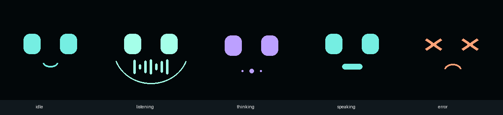

# AI Cube

머리를 톡 건드리면 이야기를 듣고 대답하는 작은 책상 친구. Raspberry Pi Zero2W와 OrcaRouter를 사용한다.

**이 저장소는 코드·배선·케이스를 포함한 제작용 프로토타입 패키지다. 실제 부품 조립 및 유료 API 호출은 아직 검증하지 않았다.**



## 구성

- 약82×78×82mm 큐브, 둥근 모서리, 바깥에 센서가 드러나지 않는 머리.
- 1.3인치 컬러 화면: 대기 / 듣기 / 생각 / 말하기 / 오류 표정.
- 안쪽 정전식 전극과 AT42QT1010. 손을 대면 한 번 녹음하며 손을 떼어도 계속 듣는다.
- USB 마이크 → OrcaRouter 음성 이해·추론 → OrcaRouter TTS → MAX98357A와 스피커.
- 녹음 최대12초, 무발화5초 취소, 발화 후1초 무음 종료. 대기 중에는 마이크 입력을 열지 않는다.
- 유선5V 전원. 클라우드 추론이라 Pi에 대형 모델을 올릴 필요가 없다.

## 제작 파일

| 시작할 일 | 파일 |
|---|---|
| 부품 고르고 연결하기 | [BOM·정확한 배선](docs/hardware.md) |
| OS 설치부터 작동시키기 | [설치·점검·자동 실행](docs/setup.md) |
| 케이스 출력·조립하기 | [케이스 모델과 조립 안내](docs/enclosure.md), [CAD 폴더](cad/) |
| API 키·기기 설정 | [.env.example](.env.example) |
| 실행 코드 | [ai_cube](ai_cube/) |
| 부팅 자동 실행 | [systemd 서비스](deploy/ai-cube.service) |
| 검증 범위 확인 | [테스트 기록·실물 합격 기준](docs/verification.md) |
| 설계 기준 | [design.md](docs/design.md) |

```bash
python -m pip install Pillow numpy
python -m unittest discover -s tests -v
python -m ai_cube --simulate
```

위 명령은 PC에서 돌리는 오프라인 미리보기다. 실제 Pi 실행은 [설치 안내](docs/setup.md)를 따른다. API 키는 기기의 `.env`에만 넣는다.

## 동작

`머리 감지 → 듣는 표정 → 녹음 → 생각하는 표정 → API 답변 생성 → 말하는 표정과 음성 → 대기`

감지부는 플라스틱 안쪽의 **접촉·초근접 정전식 센서**다. 공중 감지 거리는 조립 상태에 따라 달라지므로 수cm 거리 감지를 보장하지 않는다. 음량 기반 발화 판정, 독립적인1회 질문, 상태 기반 입 애니메이션을 제공한다. 장기 기억·상시 청취·답변 도중 끼어들기는 구현 범위에 포함하지 않았다.

OrcaRouter의 [음성 입력 공식 문서](https://docs.orcarouter.ai/advanced/audio-input)와 [TTS 공식 문서](https://docs.orcarouter.ai/other-apis/tts)에 맞춘 어댑터다. 기본 음성 모델은 `google/gemini-2.5-flash`, TTS는 `openai/tts-1`. 모델 가용성·계정 권한·실제 응답은 본인의 키로 최종 확인해야 한다.
