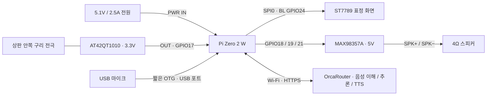

# 부품 선정과 배선

이 구성은 **Raspberry Pi Zero 2 W + USB 입력 + I2S 출력 + SPI 화면 + 디지털 정전식 센서**다. 모든 GPIO 번호는 BCM이며 물리 핀도 함께 적었다. 납땜과 조립은 전원을 분리한 상태에서 한다.

## 구매 목록

| 역할 | 선정 부품 / 수량 | 선정 이유·확인 사항 |
|---|---|---|
| 본체 | Raspberry Pi Zero 2 W ×1 | 65×30 mm, RAM512MB, 2.4GHz Wi-Fi. 연산은 API에서 수행 |
| 저장 | microSD 32GB, A1 등급 ×1 | Raspberry Pi OS Lite 64-bit. 카드·전원은 별도 |
| GPIO | 2×20 2.54mm 핀헤더 ×1 | Zero2W 기본형은 미실장. 직각/일자 선택 시 케이스 내부 높이 확인 |
| 얼굴 | Waveshare **1.3inch LCD Module, SKU15867** ×1 | ST7789, 240×240, PCB45×31mm. OLED/HAT/Pico 버전과 구분 |
| 마이크 | Adafruit **Mini USB Microphone #3367** ×1 | 약22.2×18.3×7mm. USB 오디오 입력, GPIO 미사용 |
| USB 케이블 | Micro USB 수 → USB-A 암 **OTG 데이터** 짧은 케이블 ×1 | Pi의 USB 포트에 연결. 커넥터와 꺾임 공간은 별도 필요 |
| 음성 앰프 | Adafruit **MAX98357A #3006** ×1 | I2S 입력, 모노 Class-D 출력. 5V 급전, 3.3V 신호 |
| 스피커 | Adafruit **#3968**, 40mm, 4Ω ×1 | 현재 제품명5W, 이전3W. MAX98357A 출력 범위로 구동. 약20mm 깊이 |
| 머리 센서 | Adafruit **AT42QT1010 #1374** ×1 | 순간형 active-high 출력. 토글형 AT42QT1012와 구분 |
| 숨김 전극 | 구리 테이프 35×35mm ×1 | 상판 내부에 붙이고 센서의 외부 전극 패드에 납땜 |
| 전원 | 정품급 **5.1V 2.5A Micro USB 전원** ×1 | Pi PWR IN 포트에 연결. 배터리/충전 회로는 사용하지 않음 |
| 배선 | 짧은 절연선, 수축튜브, 소형 전원 분배 기판 | 납땜 또는 고정 커넥터. 뒤틀리는 임시 점퍼는 최종 조립에서 고정 |
| 제작 부자재 | PLA/PETG, 나일론 나사·너트, 얇은 절연 테이프, 폼 가스켓, 케이블타이 | 규격·수량은 [케이스 안내](enclosure.md) 기준 |

가격은 지역·배송·보드 리비전에 따라 달라지므로 구매 시 위 **제품 번호**를 기준으로 확인한다. 실제 부품 구매는 수행하지 않았다.

## 전원과 신호

| 부품 단자 | Raspberry Pi BCM / 전원 | 물리 핀 | 비고 |
|---|---|---:|---|
| LCD VCC | 3V3 | 1 | 이 모델의 3.3V 입력 사용 |
| LCD GND | GND | 6 | 공통 접지 |
| LCD DIN | GPIO10 / MOSI | 19 | SPI0 |
| LCD CLK | GPIO11 / SCLK | 23 | SPI0 |
| LCD CS | GPIO8 / CE0 | 24 | SPI0.0, active-low |
| LCD DC | GPIO25 | 22 | 명령/데이터 |
| LCD RST | GPIO27 | 13 | active-low |
| LCD BL | **GPIO24** | **18** | 제조사 예제 GPIO18에서 변경! |
| QT1010 VIN | 3V3 | 17 | **5V로 구동하지 않는다**: OUT을 Pi에 직접 연결 |
| QT1010 GND | GND | 9 | 공통 접지 |
| QT1010 OUT | GPIO17 | 11 | 감지 시3.3V, 소프트웨어40ms 디바운스 |
| QT1010 외부 전극 패드 | 구리 전극 | — | 전원·GND가 아닌 외부 감지 패드. 짧은 절연선 |
| MAX98357A VIN | 5V | 2 | 앰프 전원은 GPIO 출력이 아닌5V 전원 핀 |
| MAX98357A GND | GND | 14 | Pi와 공통 |
| MAX98357A BCLK | GPIO18 / PCM_CLK | 12 | **LCD BL과 공유 금지** |
| MAX98357A LRC | GPIO19 / PCM_FS | 35 | I2S 워드 클록 |
| MAX98357A DIN | GPIO21 / PCM_DOUT | 40 | Pi에서 앰프로 출력 |
| MAX98357A SD/MODE | 연결 없음 | — | Adafruit 보드 기본 풀업/모노 믹스 사용. overlay의 no-sdmode와 짝 |
| MAX98357A GAIN | 연결 없음 | — | 기본 이득. 앱에서 PCM 볼륨25%로 시작 |
| 앰프 SPK+ / SPK− | 스피커 두 단자 | — | **스피커 어느 단자도 GND에 연결하지 않는다** |
| USB 마이크 | Pi **USB** → OTG → 마이크 | — | PWR IN 포트와 구분 |
| 전원 어댑터 | Pi **PWR IN** | — | 외부 전원 입력은 이 포트 하나 |

GPIO20(PCM_DIN) 및 SPI MISO는 이 설계에서 사용하지 않는다. GPIO와 전원핀은 서로 바꾸면 안 된다. 헤더 방향을 사진만 보고 추정하지 말고 보드의 1번 핀과 공식 핀맵을 확인한다.

## 머리를 만지는 동작

센서는 상판 내부에 숨긴다. 상판 중심 감지 영역의 플라스틱 두께는1.0mm, 구리 전극은35×35mm다. **손을 가볍게 대거나 매우 가까이 가져가는 동작**을 목표로 한다. 이 부품은 거리 센서가 아니므로 수cm 떨어진 손을 안정적으로 검출한다고 보장하지 않는다. 기본 합격 기준은 케이스 외부 접촉으로 작동하는 것이며 비접촉 거리는 조립 후 기록한다.

전극은 매끈하게 밀착하고 도선은 가급적30mm 이내로 한다. 검정 도전성/탄소 섬유 필라멘트, 금속 도장, 전극 바로 아래 접지판을 피한다. 스피커 자석·앰프·클록선·전원선과 떨어뜨린다. 센서 보드의 표시 LED는 상판 밖으로 보이지 않도록 내부에서 차광한다. 플라스틱 소재, 습도, 케이블과 책상 접지 상태에 따라 감도는 달라진다.

완전히 조립한 뒤 손을 떼고 전원을 켜 자동 보정되게 한다. 짧은 접촉 후 손을 떼어 말하면 된다. 장시간 누르면 센서 자체의 보정/타임아웃 동작이 있을 수 있으므로 길게 누르는 제스처는 기능으로 쓰지 않는다. 감도가 부족하면 먼저 접착 공극·전극 연결·상판 두께를 확인한다. 감도 캐패시터 변경은 제조사 가이드와 데이터시트에 따른 실물 튜닝 단계이며, 코드 값으로 아날로그 감도를 높일 수는 없다.

## 소리·열·조립

- 마이크의 실제 음향 구멍을 케이스 마이크 그릴 쪽으로 향하게 하고 얇은 폼으로 통로를 만든다. 스피커와 마이크 사이에 폼을 넣어 기구 진동을 줄인다.
- 답변 재생 중에는 마이크 입력을 열지 않는다. 다만 말하는 중 끼어들기/에코 제거 기능은 제공하지 않는다.
- 스피커 선은 짧게 꼬아서 전극에서 떨어뜨린다. Pi 안테나 주변에는 구리 전극·금속·케이블 다발을 붙이지 않는다.
- 전원 분기에는 절연된 분배 기판을 사용하고 여러 선을 한 핀에 억지로 끼우지 않는다. 앰프 가까이100µF/10V 전해 캐패시터를 추가하는 것은 노이즈가 있을 때의 선택 부품이며 극성을 확인한다.
- 통풍구와 외부 전원 케이블을 막지 않는다. 조립 후30분 동작에서 온도와 저전압 플래그를 확인한다. 실물 발열·EMI·오디오 품질은 아직 시험하지 않았다.

## 제조사 근거 (2026-09-07 확인)

- [Raspberry Pi Zero2W 규격](https://www.raspberrypi.com/products/raspberry-pi-zero-2-w/)
- [Waveshare SKU15867 LCD](https://www.waveshare.com/product/displays/lcd-oled/lcd-oled-3/1.3inch-lcd-module.htm), [제조사 드라이버 예제](https://files.waveshare.com/upload/8/8d/LCD_Module_RPI_code.zip)
- [Mini USB microphone #3367](https://www.adafruit.com/product/3367)
- [AT42QT1010 #1374](https://www.adafruit.com/product/1374), [센서 가이드](https://learn.adafruit.com/adafruit-capacitive-touch-sensor-breakouts)
- [MAX98357A #3006](https://www.adafruit.com/product/3006), [Pi 설정 가이드](https://learn.adafruit.com/adafruit-max98357-i2s-class-d-mono-amp/raspberry-pi-usage)
- [스피커 #3968](https://www.adafruit.com/product/3968)
- [Pi Linux max98357a overlay 소스](https://github.com/raspberrypi/linux/blob/rpi-6.12.y/arch/arm/boot/dts/overlays/max98357a-overlay.dts): no-sdmode 옵션, 카드명MAX98357A 확인. 설치된 OS의 `dtoverlay -h max98357a`도 확인한다.
